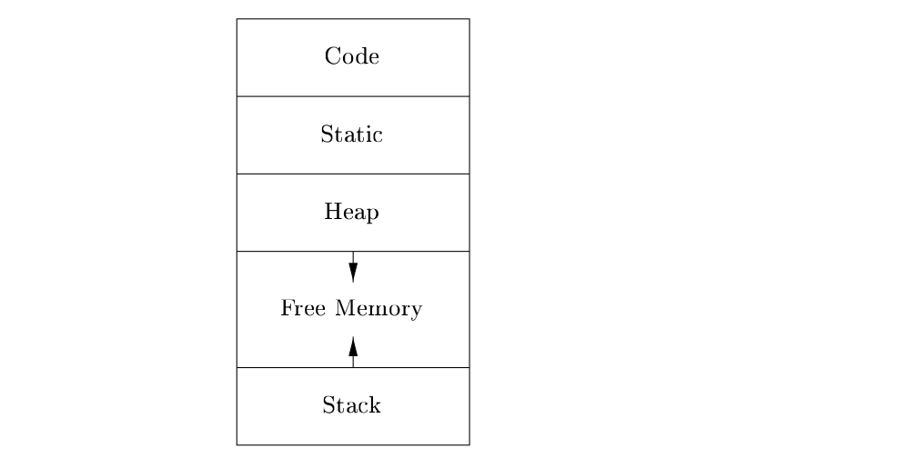
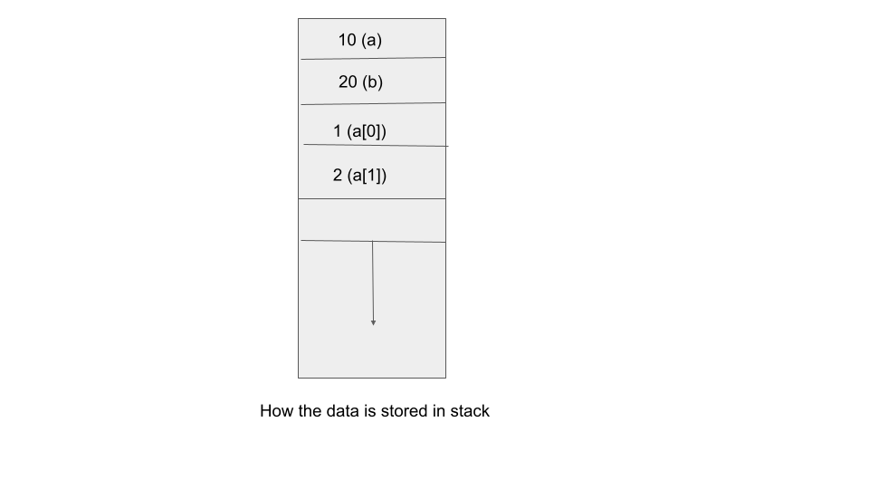

# Prerequisites

## Memory Layout

{width=50%}

-   In practice, the stack grows towards lower addresses, the heap towards
    higher(the diagram has it the other way around, but that doesn't matter).

\pause

-   What are all these things ??

\pause

-   We are mainly concerned withe the stack and the heap for the purpose of this
    talk, but we'll see what the other things are as well.

## Code and Static segments

-   Code : The size of the generated target code is fixed at compile time, so
    the compiler can place the executable target code in a statically determined
    area Code, usually in the low end of memory.

\pause

-   Static : The size of some program data objects, such as global constants,
    and data generated by the compiler that may be known at compile time, and
    these data objects can be placed in another statically determined area
    called Static.

\pause

```c
const char* s = "Lorem Ipsum something something";
int main(){
  const char* string_arr[] = {"Made", "with", "love", "by", "Delta", "Force"};
  return 0;
}
```

All the strings used in the above code segment are stored in static section,
while the instructions generated for the program will be in code section.

## Stack and Stack Allocation

-   The stack will store things such as local variables, return address from a
    function call, etc.

```c
int main(){
  int a = 10; // This is doing stack allocation
  int b = 20;
  int arr[2] = {1,2};
  return 0;
}
```

{width=50%}

## Heap and Heap Allocation

-   Many programming languages allow the programmer to allocate and deallocate
    data under program control.

\pause

-   The heap is used to manage long-lived data.

\pause

-   C/C++ has malloc/realloc/free functions for doing heap memory management.

\pause

-   Unavoidable when we want to allocate memory whose size is known only when
    the program is running(dynamic allocation).

\pause

```c
int* f(){
  return malloc(10*sizeof(int));
}
int main(){
   int n ;
   scanf("%d", &n);
   int *arr = f(); // arr is heap allocated,returned from call to f
   free(arr); //Since, we're good programmers, we'll free the memory as well.
}
```

## What exactly are malloc/realloc/free?

-   They're just functions that help us with heap allocation
-   We call `malloc` with argument `x` when we want to allocate `x` number of
    bytes we want to allocate in heap.
-   We call `realloc` when we want to increase the size of previously allocated
    heap memory. One possible reason for using this is for resizing an array.
-   We call `free` when we are done with the heap allocated memory and we want
    to return it back to the operating system.

# Introduction to Memory Management

-   Memory Management is mainly just the act of allocating heap memory and
    freeing them appropriately.

\pause

-   Stack allocations need not be freed, it's managed automatically with
    **scopes**(we'll see what scope means in next slide).

\pause

### Important terminology

-   Memory Leak: It happens when you ask the operating system for memory but
    don't return it back.

## What is this scope thing??

```c
// NOTE: This function won't compile
int f(){ // scope '1 starts
    int a = 10;
    { // scope '2 starts
       int b = 20;
    } // scope '2 ends
    if(a == 10){ scope '3 starts
      int c = 30;
    } // scope '3 ends
    return b; // This fails because it's not in scope
} // scope '1 ends
```

## Why should I care about freeing memory? Is it really a problem?

-   You don't need to care if you have infinite memory in your system. But
    sadly, there is only finite memory.

\pause

-   If one program takes up all the memory, other programs(that may require
    memory) won't be able to progress normally.

\pause

-   Your program may crash if it asks for more memory that the operating system
    can provide.

\pause

-   Memory leaks will especially affect long running programs such as web
    servers, editors, IDEs, etc.

# Ways to manage memory

We have two ways to do memory management.

\pause

-   **Manual Memory Management** : Languages such as C, C++, Rust, etc have this

-   **Automatic Memory Management**: Languages such as Python, Java, Go,
    JavaScript, Swift, etc have this.

# Manual Memory Management

# Introduction to Automatic Memory Management

# Reference Counting

# Trace Based Collection

# Which is better?(Automatic Memory Management or Manual Management

# Advanced Topics in Garbage Collection

-   Incremental GC

-   Parallel and Concurrent GC

-   Precise and Conservative Garbage Collectors

-   Reducing GC pause\*

# References

-   [Some presentation on GC, Grinnel college](https://rebelsky.cs.grinnell.edu/Courses/CS302/99S/Presentations/GC/)
