# Prerequisites

## Memory Layout

::: columns

:::: {.column width=10%}

::::

:::: {.column width=90%}
\pause

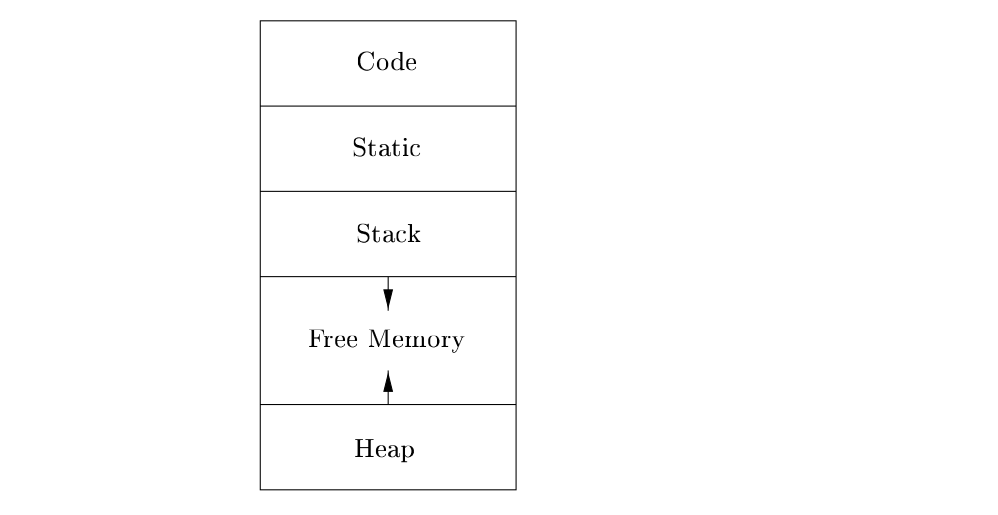{width=100%}

::::

:::

\pause

- In practice, the stack grows towards lower addresses, the heap towards
  higher(the diagram has it the other way around, but that doesn't matter).

\pause

- What are all these things ??

## Code and Static segments

- **Code**: Generated target code has a fixed size, allowing it to be stored in a statically determined area called Code, usually at the low end of memory.

\pause

- **Static**: Statically determined data objects, such as global constants and data generated by the compiler at compile time, can be stored in another area called Static.

\pause

```c
const char* s = "Lorem Ipsum something something";
int main(){
  const char* string_arr[] = {"Made", "with", "love", "by", "Delta", "Force"};
  return 0;
}
```

All the strings used in the above code segment are stored in static section,
while the instructions generated for the program will be in code section.

## Stack and Stack Allocation

\pause

- The stack will store things such as local variables, return address from a
  function call, etc.

## Stack and Stack Allocation(continued)

::: columns

:::: {.column width=40%}

\vspace{30pt}

```c
int main(){
// All of this is
// doing stack allocation
  int a = 10;
  int b = 20;
  int arr[2] = {1,2};
  return 0;
}
```

::::

:::: {.column width=60%}

\pause

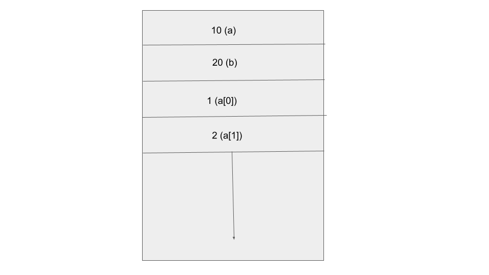

::::

:::

## Heap and Heap Allocation

\pause

- Many programming languages allow the programmer to allocate and deallocate
  data under program control.

\pause

- The heap is used to manage long-lived data.

\pause

- Unavoidable when we want to allocate memory whose size is known only when
  the program is running(dynamic allocation).

\pause

- C/C++ has \texttt{malloc/realloc/free} functions for doing heap memory management.

\pause

\footnotesize

```c
int* f(int n){
  return malloc(n*sizeof(int));
}
int main(){
   int n ;
   scanf("%d", &n);
   int *arr = f(n); // arr is heap allocated,returned from call to f
   free(arr); //Since, we're good programmers, we'll free the memory as well.
}
```

\normalsize

## What exactly are malloc/realloc/free?

\pause

- \texttt{\textcolor{red}{malloc(x)} }: allocate `x` bytes in heap

\pause

- \texttt{\textcolor{red}{ realloc(p, x) }}: resize previously allocated heap memory

\pause

- \texttt{\textcolor{red}{ free(p) } }: return heap memory to the operating system

# Introduction to Memory Management

\pause

- Memory management is all about using \texttt{heap memory} correctly.

\pause

- Stack allocations don't need to be freed; they're automatically managed with **scopes** (we'll talk about scopes in the next slide).

\pause

- If it's done incorrectly, the program can \textcolor{red}{crash} or \textcolor{red}{slow down}.

\pause

- There are different techniques for managing heap memory.

## What is this scope thing??

\pause

\centering Easier to understand with an example

\pause

::: columns

:::: {.column width=10%}

::::

:::: {.column width=90%}

\footnotesize

```cpp
// NOTE: This function won't compile
int f(){ // scope '1 starts
    int a = 10;
    { // scope '2 starts
       int b = 20;
       { // scope '3 stars
           int c = 50;
       } // scope '3 ends
    } // scope '2 ends

    if(a == 10){ // scope '4 starts
      int c = 30;
    } // scope '4 ends
    else { // scope '5 starts
       int c = 90;
    } // scope '5 ends
    return b; // This fails because it's not in scope
} // scope '1 ends
```

\normalsize

::::

:::

## What is this scope thing?? (continued)

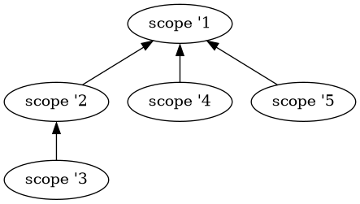

## Why should I care about freeing memory? Is it really a problem?

\pause

- If your system has infinite memory, you don't need to worry. However, since memory is finite, you must take care.
  \pause
- If one program uses up all the memory, other programs that require memory won't be able to function properly.
  \pause
- Your program may \textcolor{red}{crash} if it requests more memory than the operating system can provide.
  \pause
- \textcolor{red}{Memory leaks} can have a significant impact on long-running programs such as \texttt{web servers, editors, and IDEs}.

\pause

### Important terminology

- \textbf{\textcolor{red}{Memory Leak}}: It happens when you ask the operating system for memory but
  don't return it back.

# Ways to manage memory

We have two ways to do memory management.

\pause

- **Manual Memory Management** : Languages such as C, C++, Rust, etc have this

\pause

- **Automatic Memory Management**: Languages such as Python, Java, Go,
  JavaScript, Swift, etc have this.

# Manual Memory Management

## Scenarios where you can go wrong

::: columns

:::: column

\scriptsize

```cpp
// NOTE: this is a dumb example to show where things can go wrong,
// I don't actually write code like this
int* allocate_and_throw_exn(int n){
   int *arr = malloc(n*sizeof(int));
   if (n < 10){
       throw runtime_error("n < 10");
   }
   return arr;
}
int main(){
    try {
        auto *arr = allocate_and_throw_exn(2);
        free(arr);
    } catch(const std::runtime_error &e){
        cout << "Error:" <<e.what() << endl;
    }
}
```

\normalsize

::::

:::: column

\vspace{30pt}

\pause

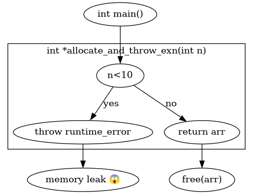{width=115%}

::::

:::

## Scenarios where you can go wrong

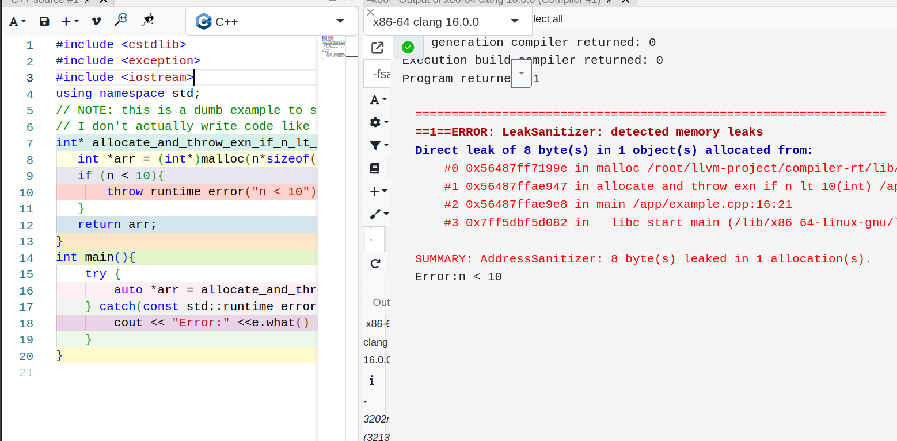{width=100%}

## How to fix it??

\pause

- \textcolor{red}{DON'T WRITE DUMB CODE LIKE I DID}

\pause

- More high level language(than C) like C++, Rust provide us with smart ways to manage memory

\pause

- They come built-in with smart pointer types like \texttt{unique\textunderscore ptr} (C++)

## Fixing the code with smart pointer

::: columns

:::: column

\scriptsize

```cpp
# \textcolor{red}{LEAKING CODE}
int* allocate_and_throw_exn(int n){
   int *arr = malloc(n*sizeof(int));
   if (n < 10){
       throw runtime_error("n < 10");
   }
   return arr;
}
int main(){
    try {
        auto *arr = allocate_and_throw_exn(2);
        free(arr);
    } catch(const std::runtime_error &e){
        cout << "Error:" <<e.what() << endl;
    }
}
```

\normalsize

\pause

::::

:::: column

\scriptsize

```cpp
# \textcolor{red}{FIXED CODE}
std::unique_ptr<int[]> allocate_and_throw_exn(int n){
   auto arr = std::unique_ptr<int[]>(new int[n]);
   if (n < 10){
       throw runtime_error("n < 10");
   }
   return arr;
}
int main(){
    try {
        auto arr = allocate_and_throw_exn(2);
    } catch(const std::runtime_error &e){
        cout << "Error:" <<e.what() << endl;
    }
}
```

\normalsize
::::

:::

\pause
\begin{center}

\textbf{\textcolor{red}{What the hell just happened??}}
\end{center}

## How do smart pointers work?

\pause

- Uses **scope** to track lifetime of a pointer(scopes mentioned in [previous section](#what-is-this-scope-thing))

\pause

- C++ uses \texttt{destructors} to run code when an object goes out of scope. (due to \textcolor{red}{RAII} in C++)

## How do smart pointers work? (continued)

### What is RAII in C++?

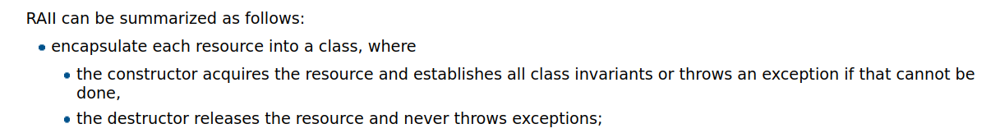

## Destructors In Action

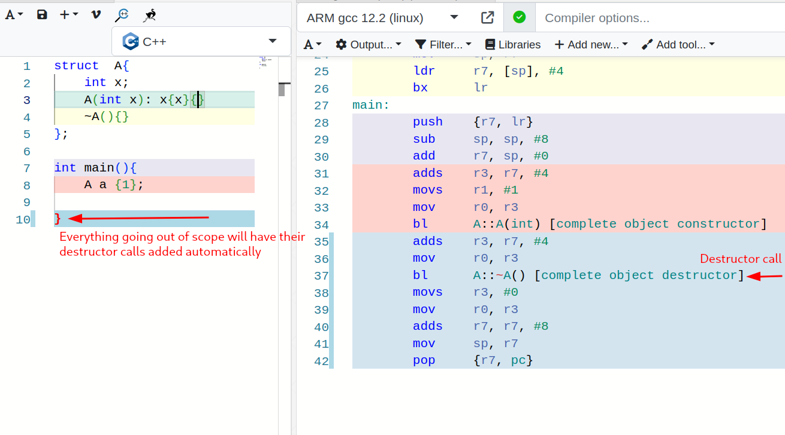

## Let's make our own unique_ptr

\pause

::: columns

:::: column

\scriptsize

```cpp
#include <iostream>
using namespace std;
class int_ptr{
    int* x ;
public:
    int_ptr(int x): x{new int(x)}{}
    ~int_ptr(){
        delete x;
    }
    int& operator*(){
        return *x;
    }
};
int main(){
    int_ptr one(1);
    cout << *one << endl;
}
```

\normalsize

::::

:::: column

\vspace{30pt}

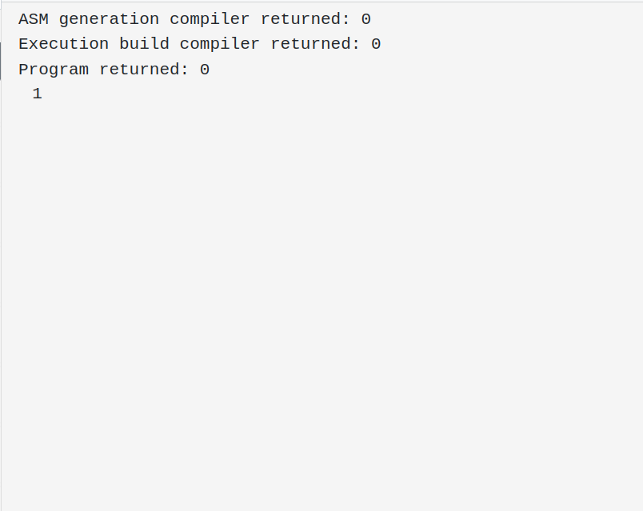

::::

:::

## Is unique_ptr the only smart pointer??

\pause
\huge
\centering\textbf{\textcolor{red}{ NO }}
\normalsize

## Isn't unique_ptr perfect already? Why would I need anything else?

\pause

- Problem with \texttt{unique\textunderscore ptr} is that it can have only one owner.

\pause

### Case in Point

- A \texttt{unix file descriptor}

\pause

- A file descriptor can have multiple owners. It should only be freed when all the owners go out of scope.

## File Descriptors Example and what's the problem

\pause

\centering \textcolor{red}{DISCLAIMER:} The code that I'm about to show is cursed
and no one should model a file descriptor like this

\pause

\centering But, we'll do it still(for the purpose of this talk)

## File Descriptors (continued)

\pause

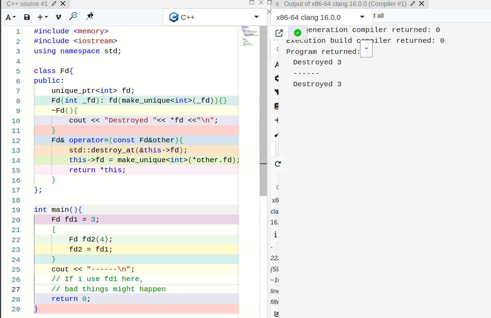{width=90%}

\pause

\vspace{-10pt}

\centering {\textcolor{red}{\textbf{Not possible to model this correctly }}}

## Another classic example (why only unique_ptr isn't enough?)

- \textcolor{red}{SPMC(Single Producer Multiple Consumer) } and \textcolor{red}{MPMC(Multiple Producer Multiple Consumer)} problem

\pause

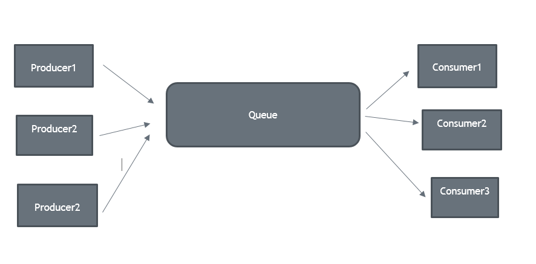{width=80%}

\pause

- Requires multiple owners for producer end as well as the consumer end

# Introduction to Automatic Memory Management

\pause

- The programming language you're using is responsible for memory management.
  The language runtime handles everything.

\pause

- Programmer doesn't have the mental burden of dealing with memory.

\pause

- All the allocation/deallocation calls are hidden from the programmer.

\pause

### \centering IMPORTANT TERMINOLOGY

\pause

\begin{center}
\textcolor{red}{Data that cannot be referenced is generally known as \textbf{garbage}}
\end{center}
\pause

### \centering Two techniques used primarily

\pause

- We catch the transitions as \texttt{reachable}(in-scope) objects turn \texttt{unreachable}(out-of-scope). \pause Example: \textcolor{red}{Reference Counting} based memory management in Python, Swift,etc., C++ shared_ptr, Rust's Rc and Arc types

\pause

- We periodically locate all the \texttt{reachable} objects and then infer that all the other objects are \texttt{unreachable}. \pause Example: \textcolor{red}{Trace Based Garbage Collection} such as mark and sweep garbage collector used in language like Java, JavaScript, etc.

# Reference Counting

\pause

- All the transitions from reachable to unreachable are caught immediately.
  \pause

### Backed by simple rules

\pause

- Every allocated pointer has a \textcolor{red}{reference count} associated with it
  \pause
- Every copy leads to reference count increment.
  \pause
- Every time a reference of the pointer goes out of scope, reference count is decremented by $1$.
  \pause
- When the reference count goes to $0$, it is safe to \texttt{free} the object.

## C++'s shared_ptr type

\pause

- It is a \texttt{reference-counted pointer}, manages the \texttt{reference count} elegantly with assignment operator overload, copy constructor overload, destructors, etc.

## Let's solve our file descriptor issue

\pause

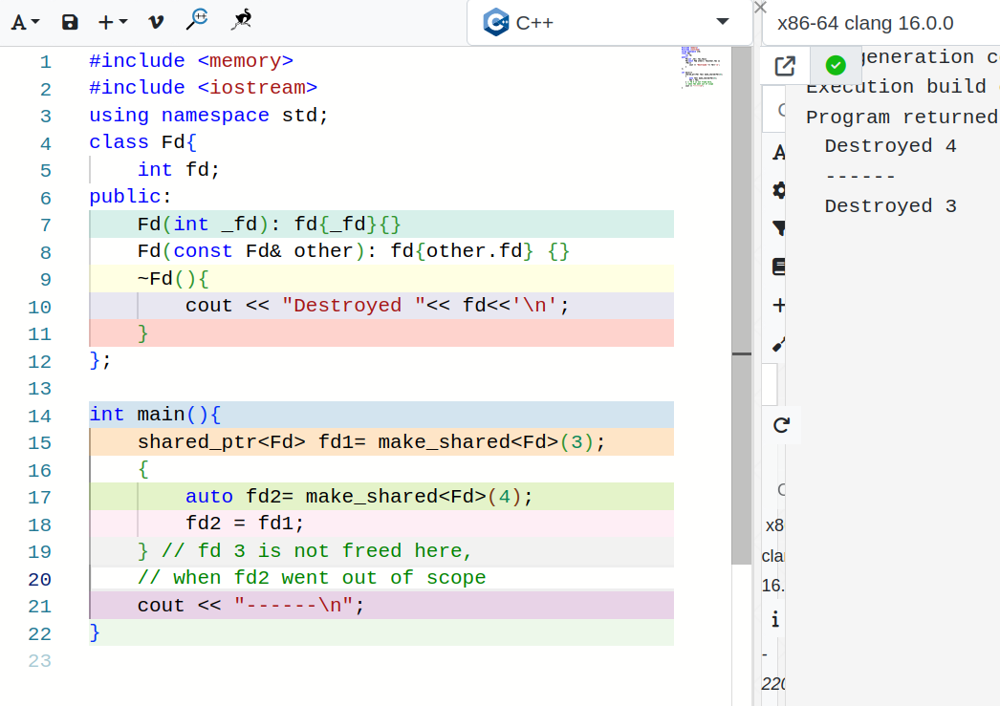{width=85%}

# Trace Based Garbage Collection

\pause

- Periodically locates all the \texttt{reachable} objects and then infers that all the other objects are \texttt{unreachable}

\pause

- A pointer is reachable $\textcolor{red}{\Rightarrow }$ There's a root somewhere(in stack, register, static, etc.) from where we can transitively access the pointer.

## What's a root?

\pause

Think of them as root nodes of a graph, something that you have direct access to.

\pause

A \texttt{GC} will treat all the stack variables, registers, static section, as roots.

\text

::: columns

:::: column

\pause

\scriptsize

```ocaml
type baz = {
    x: int;
    y: int
}
type bar = {
    a:  int;
    b:  baz
}
type foo = {
    field1 : bar;
    field2: int
}
let foo_instance: foo = {
    field1 = {
        a  = 10;
        b = { x= 2 ;y= 5; };
    };
    field2= 5;
}
```

\normalsize

::::

:::: column

\pause
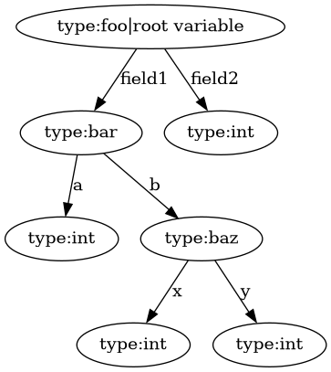{width=80%}

::::

:::

## Root finding

\pause

- \textcolor{red}{It involves many intricate details, which took me quite a while to understand.}

\pause

- You'd probably want to design a \texttt{precise-collector} if you're building your own language.
  \pause \textcolor{red}{Precise Collector} is when GC knows about root objects: where they’re placed
  on stack,their size,lifetime etc. \pause Most popular language runtimes use precise garbage collectors:
  Python, PyPy, JVM(Java), .NET(C#), Lua, V8(JavaScript) ,SpiderMonkey(JavaScript) and a lot of others.

\pause

- Conservative collection does not know about types of traced GC objects. \pause It'll assume
  everything that's present in the stack, static and register are pointers and it'll follow it. \pause They are inherently unsafe. \pause Example: Boehm-Demers-Weiser conservative C/C++ Garbage Collector

## Tracing GC Algorithms

\pause

All trace-based algorithms compute the set of reachable objects and then take
the complement of this set. Memory is therefore recycled as follows:

\pause

1. The program or mutator runs and makes allocation requests.
   \pause
2. The garbage collector discovers reachability by tracing.
   \pause
3. The garbage collector reclaims the storage for unreachable objects.

\pause

### \centering Tracing Based GC Algorithms

\pause

- Copying Collector

- Mark and Sweep Collector

## Copying Collector

\pause

- \textcolor{red}{Copying Collector} partitions memory into two semispaces, A and B.
  \pause
- All the allocations are performed in one semispace until it fills up.
  \pause
- The garbage collector then copies reachable objects to the other space.
  \pause
- Roles of the semispaces are reversed when garbage collection is complete.
  \pause
- While all this is happening, the whole program is stopped. (This is why it's called a stop-the-world algorithm)

## Copying Collector (A visual representation)

\pause

::: columns

:::: column

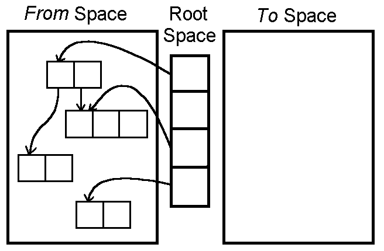{width=100%}

::::

\pause

:::: column

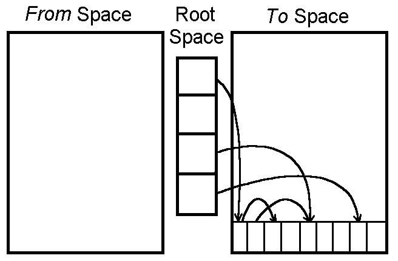{width=100%}

::::

:::

## Mark and Sweep

\pause

\centering \textbf{\textcolor{red}{Some terminology first}}

\pause

In a \texttt{mark-and-sweep} gc, An object may be in one of the 4 states: Free(Blue), Unreached(White), Unscanned(Gray), Scanned(Black)

\pause

It is also a stop-the-world algorithm.

\pause \textcolor{red}{Mark} \rightarrow responsible for marking reachable objects \texttt{Black}

\pause \textcolor{red}{Sweep} \rightarrow responsible for freeing all the unreachable( \texttt{White} ) objects.

## Mark and Sweep(continued)

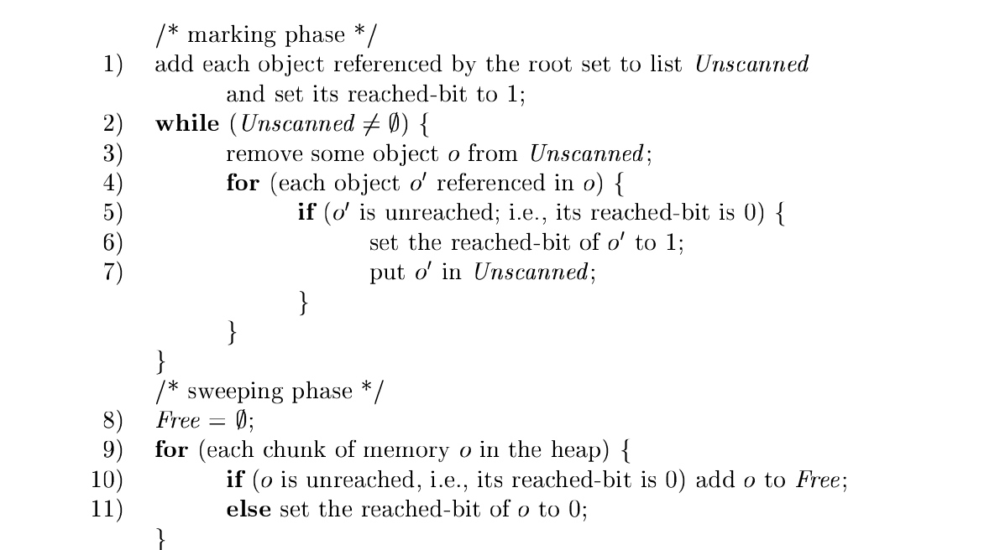

# Which is better ? (Automatic Memory Management or Manual Management)

\pause

\huge
\centering \textbf{\textcolor{red}{DEPENDS}}
\normalsize

## Case against Manual Memory Management

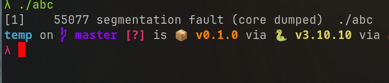

## Case against Manual Memory Management(continued)

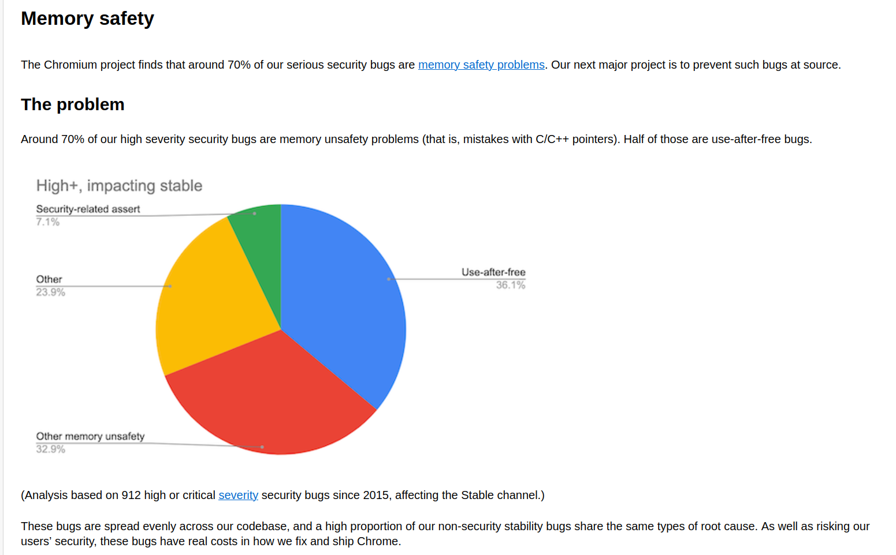

## Case against Automatic Memory Management

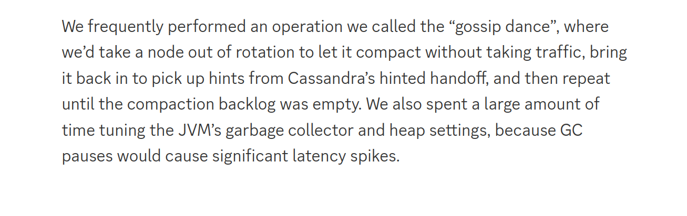

\pause

- Similar GC issues encountered by many tech giants

# Advanced Topics in Memory Management

\pause

- Advanced type system like in Rust, which help with memory safety

\pause

- Incremental GC

\pause

- Parallel and Concurrent GC

\pause

- Generational GC

\pause

- Reducing GC pauses

# References

- [https://rebelsky.cs.grinnell.edu/Courses/CS302/99S/Presentations/GC/](https://rebelsky.cs.grinnell.edu/Courses/CS302/99S/Presentations/GC/)
- [https://discord.com/blog/how-discord-stores-trillions-of-messages](https://discord.com/blog/how-discord-stores-trillions-of-messages)
- [https://gchandbook.org/](https://gchandbook.org/)
- Compilers: Principles, Techniques, and Tools by Alfred V. Aho, Monica S. Lam, Ravi Sethi, and Jeffrey D. Ullman
- [cppreference](https://en.cppreference.com/w/)
